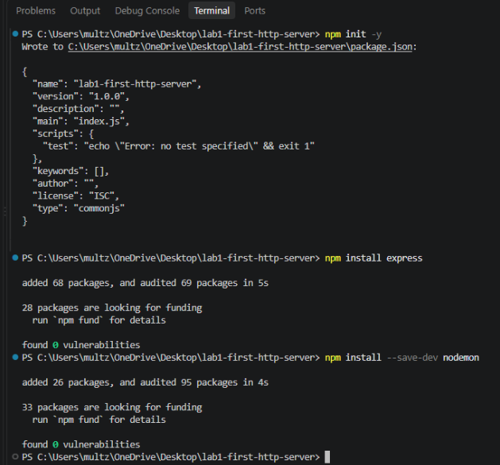
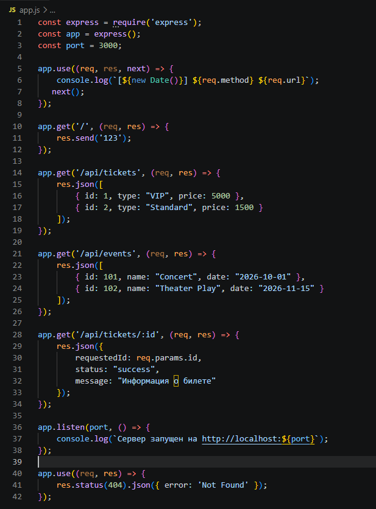
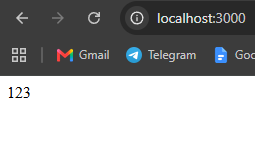
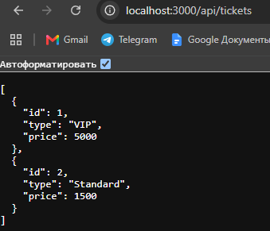
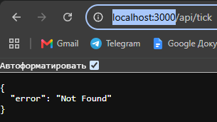
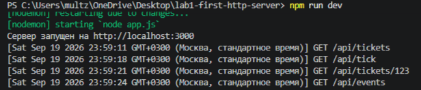

https://github.com/NXGHTMXRE007/lab1-first-http-server

# Лабораторная работа №1: Настройка среды разработки и первый HTTP-сервер

**Студент:** Евдокимов Иван Александрович
**Группа:** ПИЖ-б-о-25-2(1)
**Вариант:** 9
**Технология:** Node.js + Express

## Цель работы
Освоить установку инструментов для бэкендразработки, создать и запустить минимальный веб-сервер, обрабатывающий GET-запросы, понять концепцию эндпоинтов, научиться настраивать автоматический перезапуск сервера.


## Выполнение практического  задания
Был инициализирован проект на Node.js, установлены зависимости `express` и `nodemon`. В файле `package.json` настроен скрипт для автоматического перезапуска сервера: `"dev": "nodemon app.js"`.
Запуск сервера производится командой:
```bash
npm run dev
```













```bash

1. Что такое клиент-серверная архитектура?
В веб-разработке взаимодействие строится по модели «клиент-сервер»: клиент (браузер, мобильное приложение) отправляет HTTP-запрос, а сервер (бэкенд-приложение) принимает запрос, обрабатывает его и отправляет HTTP-ответ.   2. Какой протокол используется для общения клиента и сервера в вебе?
Основной протокол передачи данных в интернете — HTTP.   3. Что такое эндпоинт (endpoint)?
Эндпоинт (endpoint) — это конкретный адрес (URL) вместе с методом HTTP, по которому клиент обращается к серверу для получения ресурса (например: GET /api/users).   4. Какую структуру имеет HTTP-запрос и HTTP-ответ? Что такое код состояния (status code)?
HTTP-запрос и ответ состоят из стартовой строки, заголовков и тела сообщения. Код состояния (status code) — это число, которое сервер возвращает в ответе, чтобы сообщить клиенту результат обработки запроса (например, код 404).   5. Что такое JSON? Почему он популярен в веб-разработке?
JSON (JavaScript Object Notation) — это текстовый формат обмена данными, который стал стандартом де-факто для REST API, так как он прост для понимания и поддерживается большинством языков.   6. Как запустить сервер на Node.js или Flask?
Сервер на Node.js запускается командой node app.js, а на Python (Flask) — командой python app.py.   7. Что такое автоматический перезапуск сервера и зачем он нужен? Какой пакет используется для Node.js?
Автоматический перезапуск нужен для того, чтобы не останавливать и не запускать сервер вручную каждый раз, когда мы меняем код при разработке. Для Node.js для этого используется пакет nodemon.   8. Какие коды состояния HTTP вы знаете? За что отвечает код 404?
Из популярных кодов можно выделить 200 (успешно) и 500 (ошибка сервера). Код 404 означает, что запрошенный маршрут не найден.   9. Что такое middleware в Express / декораторы запросов во Flask (для продвинутого уровня)?
В Express middleware — это функции для промежуточной обработки, которые перехватывают запрос до того, как он дойдет до финального эндпоинта. Express использует их для упрощения обработки HTTP-запросов и маршрутизации.   10. Как получить параметр из URL-пути (например, ID пользователя) в вашем фреймворке?
В Express (Node.js) параметр из URL-пути можно получить через объект запроса, обратившись к req.params.id. 


```